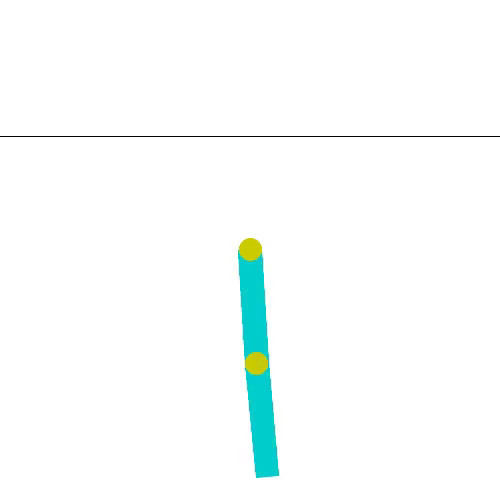

# PPO Test Task

This project is a little implementation of Proximal Policy Optimization (PPO).

This approach have been on a different gymnasium environments with MLP Agent and Critic.

## Project Structure

```
.
├── main.py (main training file with PPO trainer)
├── test_model.py (main testing)
├── environment/ (environment wrappers)
│ ├── BaseEnvironment.py
│ ├── VectorizedEnvironment.py
├── model/ (basic agent for tests)
│ ├── BaseAgent.py
│ ├── DiscreteAgent.py
│ ├── ContinuousAgent.py
├── optimizer/
│ ├── PPO.py (PPO optimizer itself)
│ ├── ...
├── examples/ (trained models and recordings of their performance)
│ ├── Acrobot-v1/
│ │ └── Acrobot-v1_ppo_model.pth
│ ├── CartPole-v1/
│ │ └── CartPole-v1_ppo_model.pth
│ ├── MountainCar-v0/
│ │ └── MountainCar-v0_ppo_model.pth
.
```

## Videos

Below are some example videos of the PPO agent in action:

- **Environment 'CartPole-v1'**: 
- **Environment 'MountainCar-v0'**: 
- **Environment 'Acrobot-v1'**: 

## Charts

The following charts show the training progress of the PPO agent:

- **Reward over Time**:
  

- **Loss over Time**:
  

## Usage

To install the required dependencies, run:

```bash
pip install -r requirements.txt
```

To train the PPO agent, run (agent will be saved under `examples/<environment_name>` dir):

```bash
python main.py --env <environment_name>
```
_the following flags can be added:
--num_envs (determ number of parallel environments to train on). Default: 4.
--allow_recording (record the video of every 100-th episode)
--allow_tensorboard (to log training progress to tensorboard)_

To test the trained PPO agent, run:

```bash
python test_model.py --env <environment_name>
```
_the following flags can be added:
--num_steps (determ number of ticks in the simulation). Default: 1000.
--allow_recording (record the video of every 100-th episode)_

Replace `<environment_name>` with the name of the Gym environment you want to train on.
